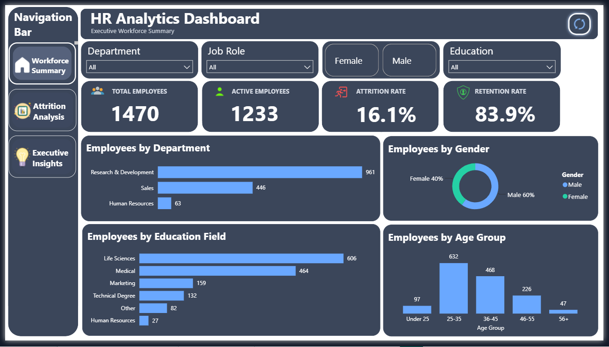
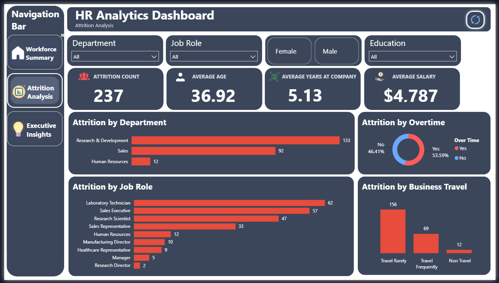
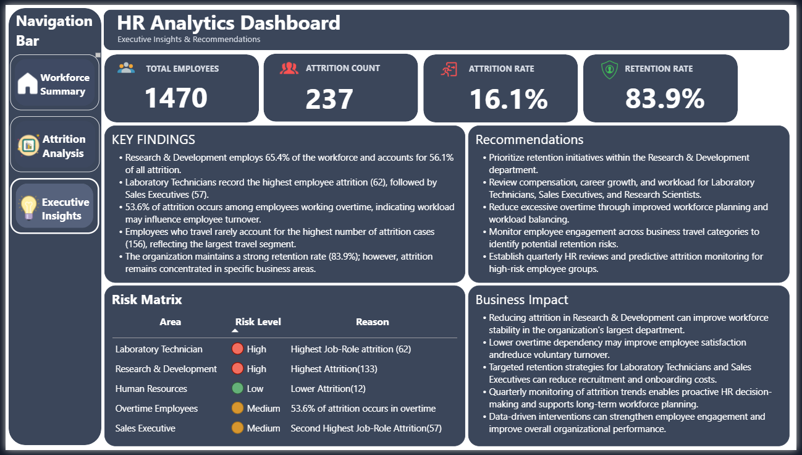
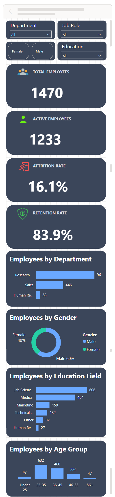
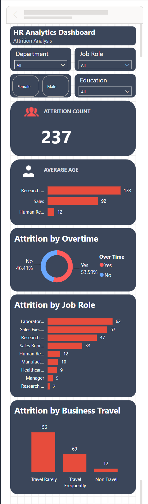
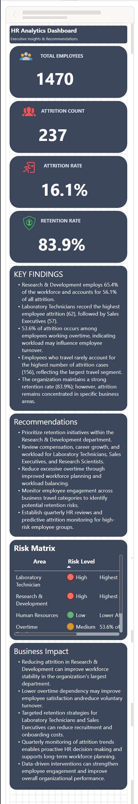

# 📊 HR Analytics Dashboard | Power BI

<p align="center">


</p>

---

# 📌 Project Overview

This project presents an interactive **HR Analytics Dashboard** developed in **Microsoft Power BI** using the IBM HR Analytics Employee Attrition dataset.

The dashboard enables HR professionals and business leaders to monitor workforce KPIs, identify employee attrition trends, analyze workforce demographics, and derive actionable business insights through interactive visualizations.

---

# 🎯 Objectives

- Analyze employee demographics
- Monitor workforce KPIs
- Identify key drivers of employee attrition
- Evaluate workforce distribution
- Support strategic HR decision-making
- Present executive-level business insights

---

# 📂 Dataset

**Dataset:** IBM HR Analytics Employee Attrition & Performance Dataset

The dataset contains information including:

- Employee Demographics
- Department
- Job Role
- Education
- Gender
- Business Travel
- Overtime
- Monthly Income
- Years at Company
- Attrition Status

---

# 🛠 Tech Stack

| Tool | Purpose |
|------|---------|
| Microsoft Power BI | Dashboard Development |
| Power Query | Data Cleaning & Transformation |
| DAX | KPI & Business Calculations |
| Data Modeling | Relationship Management |
| Power BI Mobile Layout | Responsive Dashboard |

---

# 📊 Dashboard Features

✅ Interactive Slicers

✅ Executive KPI Cards

✅ Department Analysis

✅ Job Role Analysis

✅ Attrition Analysis

✅ Workforce Demographics

✅ Business Recommendations

✅ Risk Matrix

✅ Mobile Optimized Dashboard

---

# 📈 KPIs

- Total Employees
- Active Employees
- Attrition Count
- Attrition Rate
- Retention Rate
- Average Age
- Average Salary
- Average Years at Company

---

# 📸 Dashboard Preview

## 🏢 Executive Workforce Summary



---

## 📉 Attrition Analysis



---

## 💡 Executive Insights



---

# 📱 Mobile Layout

## Executive Workforce Summary



---

## Attrition Analysis



---

## Executive Insights



---

# 🧹 Data Preparation

The dataset was transformed using **Power Query**.

Transformations included:

- Data type validation
- Column renaming
- Data cleansing
- Data modeling
- Calculated columns
- Optimized reporting model

---

# 📊 DAX Measures

Some of the key DAX measures implemented include:

- Total Employees
- Active Employees
- Attrition Count
- Attrition Rate
- Retention Rate
- Average Age
- Average Salary
- Average Years at Company

---

# 💡 Key Business Insights

- Research & Development has the largest workforce and the highest employee attrition.
- Laboratory Technicians experience the highest attrition among all job roles.
- Employees working overtime show considerably higher attrition.
- Employees who travel rarely account for the highest attrition volume.
- Overall employee retention remains strong, while attrition is concentrated within specific departments and job roles.

---

# 🚀 Business Recommendations

- Strengthen retention strategies within Research & Development.
- Reduce excessive overtime to improve employee satisfaction.
- Improve career development opportunities for high-risk job roles.
- Conduct periodic workforce health reviews.
- Use HR analytics to proactively identify attrition risks.

---

# 📁 Repository Structure

```
HR-Analytics-Dashboard
│
├── README.md
├── LICENSE
│
├── Dashboard
│   ├── HR_Analytics_Dashboard.pbix
│   └── HR_Analytics_Dashboard.pdf
│
├── Dataset
│   └── IBM_HR_Analytics_Employee_Attrition.csv
│
└── Images
    ├── Executive_Workforce_Summary.png
    ├── Attrition_Analysis.png
    ├── Executive_Insights.png
    ├── Mobile_Page1_Long.png
    ├── Mobile_Page2_Long.png
    └── Mobile_Page3_Long.png
```

---

# ▶️ Getting Started

1. Clone this repository.
2. Open the `.pbix` file using Microsoft Power BI Desktop.
3. Explore the dashboard pages.
4. Use slicers to interact with the report.
5. Review business insights and recommendations.

---

# 🔮 Future Enhancements

- Predictive Attrition Analysis using Machine Learning
- Real-time HR Dashboard
- Department Drill-through Reports
- Trend Analysis
- AI-powered HR Insights

---

# 👨‍💻 Author

**Sujay G R**

Power BI Developer

If you found this project useful, consider giving it a ⭐ on GitHub.

---
